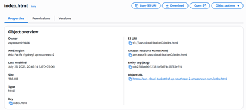
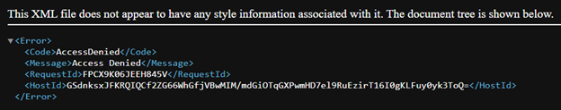
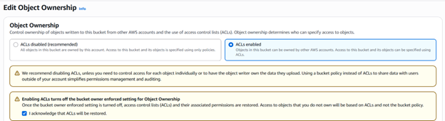
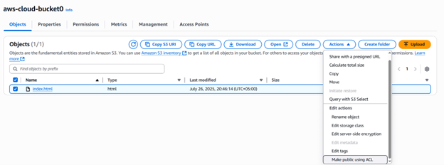

# Amazon S3 Static Website Lab

I uploaded `index.html` to S3, investigated an `AccessDenied` response, and used the console's ACL workflow to make the page readable in a browser.

**Verified result:** the final screenshot shows the page loading through the S3 **object URL**. The original notes also describe enabling static website hosting, but the retained images do not show a successful website-endpoint test.

## 1. Upload the page

The uploaded object was `index.html` in the Sydney region (`ap-southeast-2`). The object details exposed its URL for the initial browser test.



## 2. Investigate AccessDenied

The first request returned this response:

```xml
<Code>AccessDenied</Code>
<Message>Access Denied</Message>
```



Uploading the file had not granted anonymous read access. Enabling website hosting and granting permission to read an object are separate settings; website hosting is not required just to retrieve an object by its object URL.

## 3. Configure the lab

This work used the AWS Management Console. These are the settings recorded in the notes and screenshots, not a CLI execution transcript.

| Setting | Recorded value or action | Evidence |
|---|---|---|
| Object key | `index.html` | Object details screenshot |
| Static website hosting | Enable hosting; index document `index.html` | Original written notes; screenshot shows the initial disabled state |
| Block Public Access | Uncheck the block settings for this public-content lab | Permissions edit screenshot |
| Object Ownership | ACLs enabled | Ownership screenshot below |
| Object action | Make public using ACL | Object actions screenshot below |





This historical exercise made a test HTML object public. It is not a reusable production access configuration.

## 4. Verify the browser result


The page displays **Welcome to AWS** and **This is static web hosting.** Its address follows the object URL form:

```text
https://<bucket>.s3.ap-southeast-2.amazonaws.com/index.html
```

The screenshot proves browser access to the HTML object after the permission changes. It does not establish website-endpoint routing, HTTPS through CloudFront, a custom domain, or a production deployment.

## What I learned

- An uploaded object and a publicly readable object are different states.
- Object permissions and static website hosting must be diagnosed separately.
- A successful page load should be checked against the actual URL being tested.

## Documentation

- [Implementation](./docs/implementation.md)
- [Validation and troubleshooting](./docs/validation-and-troubleshooting.md)
- [All 13 original screenshots](./screenshots/README.md)
- [Original lab notes](./docs/original-lab-notes.pdf)

The screenshots contain July 2025 timestamps. This documentation does not assign the lab to the earlier training year.
