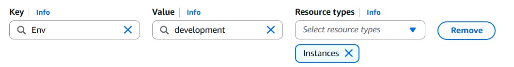
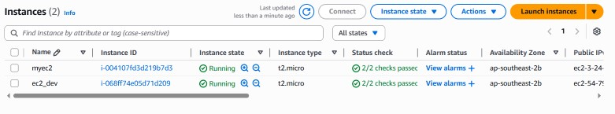
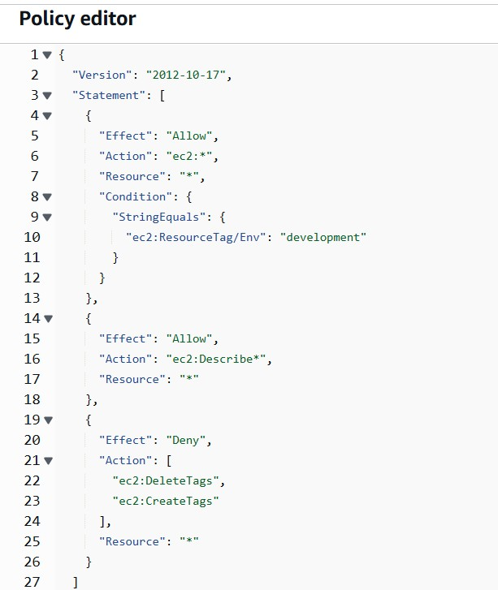
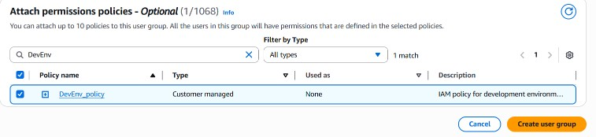
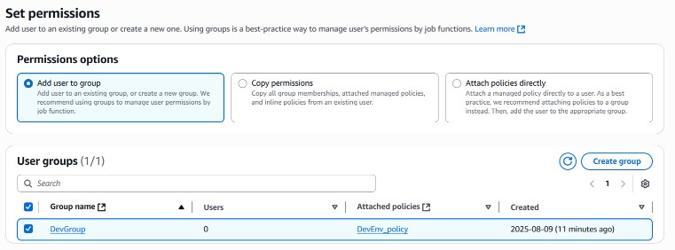
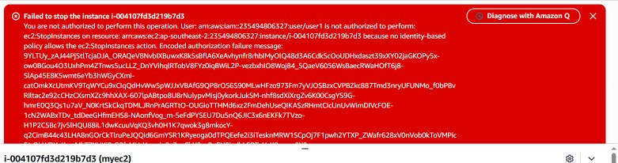

# AWS IAM Tag-Based EC2 Access Control

I created two EC2 instances, assigned a custom policy to `DevGroup`, added `user1`, and tested the user's ability to stop each instance from the AWS console.

**Observed result:** stopping the production instance was denied; the development instance reached **Stopped** while production remained **Running**.

## 1. Separate the resources

The development resource used this tag:

```text
Key:   Env
Value: development
```



The two instances appeared as `myec2` (production test target) and `ec2_dev` (development).



## 2. Define the policy

The policy was named `DevEnv_policy`. Its JSON has been transcribed from the original policy-editor screenshot into [policies/development-ec2-lab-policy.json](./policies/development-ec2-lab-policy.json). Formatting is normalized and the outer JSON object is closed; the visible statements are preserved. This is a transcription, not an exported policy file or a newly deployed policy.

```json
{
  "Version": "2012-10-17",
  "Statement": [
    {
      "Effect": "Allow",
      "Action": "ec2:*",
      "Resource": "*",
      "Condition": {
        "StringEquals": {
          "ec2:ResourceTag/Env": "development"
        }
      }
    },
    {
      "Effect": "Allow",
      "Action": "ec2:Describe*",
      "Resource": "*"
    },
    {
      "Effect": "Deny",
      "Action": [
        "ec2:DeleteTags",
        "ec2:CreateTags"
      ],
      "Resource": "*"
    }
  ]
}
```



| Statement | Purpose in this lab |
|---|---|
| Allow `ec2:*` with `ec2:ResourceTag/Env = development` | Condition access on the development tag |
| Allow `ec2:Describe*` on `*` | Permit EC2 discovery, including visibility of the production instance |
| Deny `ec2:CreateTags` and `ec2:DeleteTags` | Prevent this identity from changing tags used by the access rule |

The policy explores access boundaries, but `ec2:*` is broad. It is not a claim of a minimal production policy or proof that every EC2 action supports this condition. The screenshots validate **StopInstances**, not every action.

## 3. Assign permissions through the group

I attached `DevEnv_policy` to `DevGroup`, then added `user1` to that group with console access.





The tests were performed after signing in as the restricted user, rather than from the administrator session.

## 4. Test both sides of the boundary

Console action: **EC2 → Instances → select instance → Instance state → Stop instance**.

| Target | Action | Observed result |
|---|---|---|
| `myec2` — production | `ec2:StopInstances` | Authorization failure; instance remained running |
| `ec2_dev` — development | `ec2:StopInstances` | Instance reached Stopped |



The error identifies `ec2:StopInstances` and says no identity-based policy allows it for the production resource. This is an absent matching Allow for that action, not the explicit tag-edit Deny in the policy.


Being able to see a resource did not mean the user could stop it. The separate Describe permission explains why both instances remained visible.

## Scope and evidence

This was a console-based training lab. No CLI execution or infrastructure-as-code deployment is claimed. The policy transcription was checked as JSON and against the screenshot, but has not been redeployed in AWS as part of this documentation update.

- [Access model and policy limitations](./docs/access-model.md)
- [Implementation](./docs/implementation.md)
- [Validation](./docs/validation.md)
- [All 37 original screenshots](./screenshots/README.md)
- [Original lab notes](./docs/original-lab-notes.pdf)

The group-creation screenshot contains an August 2025 date. This documentation does not assign the lab to the earlier training year.
