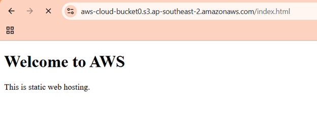
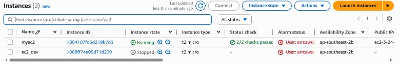

# AWS Projects

Two console-based AWS labs with configuration details, screenshots, and observed results.

| Project | Work and result |
|---|---|
| [S3 Static Website Lab](./01-s3-static-website/) | Upload `index.html`, investigate AccessDenied, configure public object access, and verify the page through its object URL |
| [IAM Tag-Based EC2 Access Control](./02-iam-access-control/) | Assign a tag-based policy through an IAM group; verify production StopInstances is denied and development stops |

## S3 — browser result

## IAM — permission test result

Each project contains a readable implementation, inline evidence, a complete screenshot index, validation notes, and the original PDF. The IAM project also includes policy JSON transcribed from its screenshot.

These are learning labs. The documentation distinguishes observed results from steps described only in notes. Retained screenshots contain 2025 timestamps; the earlier cloud-training date is not used as the project completion date.
